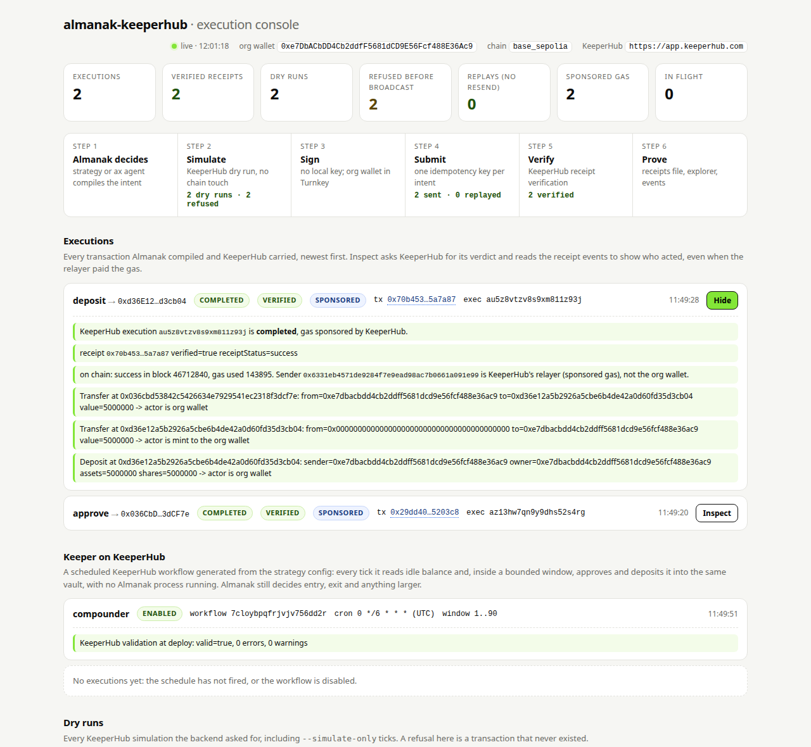

# almanak-keeperhub

[](https://github.com/Prashant-thakur77/almanak-keeperhub/actions/workflows/ci.yml)

Almanak decides. KeeperHub lands it. No strategy code changes.

**In sixty seconds.** [Almanak](https://github.com/almanak-co/sdk) is a live DeFi strategy framework whose execution layer is three abstract classes: sign, simulate, submit. This package implements all three against KeeperHub, so every Almanak strategy, unmodified, dry-runs through KeeperHub, broadcasts with one idempotency key per intent, and gets a verified receipt back into Almanak's own parsers, with no private key on the machine. Verified on the hosted app on Base Sepolia on 12 Sep 2026: the packaged demo strategy's [deposit](https://sepolia.basescan.org/tx/0x70b453be43f4b8c4d40837baa7bd6f16fa3cc909038a590978b831b6605a7a87), a KeeperHub-scheduled keeper generated from the strategy config and [run by KeeperHub's own engine](https://sepolia.basescan.org/tx/0x3e31e8c1d0d66242f11929417e3aa3dc58677f6b5c205e5ae0c23b0caa68cf16), the [redeem](https://sepolia.basescan.org/tx/0x91777e39d4fc1748f632a4e73d16e2b6475781097d9682011583635fde17f0a4), six deliberate failure modes, and a benchmark (20 of 20 impossible deposits refused before broadcast, 5 of 5 approvals landed and verified, median 6.9 s). Everything cost nothing: gas sponsored by KeeperHub, faucet USDC. Proof table below; live console and Telegram operator bot included.

[Almanak](https://github.com/almanak-co/sdk) is an open-source DeFi strategy framework (PyPI `almanak`, Apache-2.0, 46 protocol connectors). Its execution layer is built around three abstract classes, `Signer`, `Submitter` and `Simulator`, so that "multiple signing backends and submission methods" can be plugged in (`almanak/framework/execution/interfaces.py`). Today the only submitter that ships is the public mempool, and the private-relay submitter is a stub that rejects every transaction.

This package implements all three against [KeeperHub](https://keeperhub.com)'s Direct Execution API. Every Almanak strategy, unchanged, then runs like this:

1. Almanak compiles the strategy's intent into transactions (approve, deposit, swap...).
2. `KeeperHubSimulator` dry-runs the bundle through KeeperHub (`simulate: true`). A revert stops the tick before anything is signed.
3. `KeeperHubSigner` decodes each transaction's calldata into the function call KeeperHub executes and derives one idempotency key per piece of work. No private key exists on the machine; KeeperHub's Turnkey wallet signs.
4. `KeeperHubSubmitter` broadcasts through KeeperHub with that key, waits for the verified receipt, and hands Almanak a normal `TransactionReceipt` with logs, so Almanak's own receipt parsers and position tracking keep working.

## The incident this prevents

Almanak's repository documents it (`almanak/framework/execution/nonce_recovery.py`):

> Arbitrum mainnet 2026-05-18, lp_triple strategy. LP_OPEN C's mint at nonce 1635 actually landed on-chain, but the framework raised NONCE_ERROR on a follow-up read, retried, minted a duplicate dust position, and teardown closed only the tracked positions. NFT 5495063 became a zombie position the framework didn't track. Manual recovery via direct cast calls.

With KeeperHub in the loop the retry carries the same idempotency key, so KeeperHub replays the first execution instead of broadcasting again. `demos/failure_modes/duplicate_blocked_by_idempotency.py` reproduces the "landed but retried" sequence on purpose.

## Run it in five minutes

```bash
git clone <this repo> && cd almanak-keeperhub
uv venv --python 3.12 && source .venv/bin/activate
uv pip install -e ".[dev]"
cp .env.example .env            # KEEPERHUB_API_KEY (mcp:write), Base RPC URL
set -a; source .env; set +a

almanak-keeperhub doctor --chain base           # key, org wallet + balances, chain, selector index
cd demos/metamorpho_base_yield
almanak-keeperhub run --once --dry-run          # Almanak plans; nothing reaches the gateway
almanak-keeperhub run --once --simulate-only    # KeeperHub dry-runs the compiled bundle; nothing broadcast
almanak-keeperhub run --once                    # 5 USDC into the Moonwell Flagship USDC vault via KeeperHub
```

Or run the whole sequence, failure modes included: `scripts/first_run.sh`.

## The free path: Base Sepolia

Almanak ships no testnet chain: its "sepolia" network mode swaps the RPC but keeps the mainnet chain id in every compiled transaction, which would hand KeeperHub a mainnet transaction. `almanak_keeperhub/testnet.py` fixes that at the root: it registers `base_sepolia` (chain id 84532) as a first-class Almanak chain, teaches Almanak's token resolver the testnet's ETH, WETH and Circle's test USDC, and lets the ERC-4626 vault connector compile there. The unmodified demo strategy then runs on Base Sepolia through KeeperHub with sponsored gas:

```bash
scripts/deploy_test_vault.sh --rpc https://sepolia.base.org --private-key 0x...   # once; ~0.0005 Sepolia ETH from a faucet
python scripts/testnet_config.py 0x<vault>                                         # writes it into demos/metamorpho_base_sepolia/config.json
cd demos/metamorpho_base_sepolia
almanak-keeperhub doctor --chain base_sepolia
almanak-keeperhub run --once --fresh --simulate-only
almanak-keeperhub run --once --fresh                  # approve + deposit 5 test USDC into the TestVault, chain id 84532
almanak-keeperhub keeper deploy && almanak-keeperhub keeper enable
ALMANAK_KEEPERHUB_CHAIN=base_sepolia python ../failure_modes/crash_and_resume.py    # every demo and the benchmark take the same switch
```

`contracts/TestVault.sol` is a dependency-free 1:1 ERC-4626 over the test USDC, the stand-in for the Moonwell vault. The one-line difference in `demos/metamorpho_base_sepolia/strategy.py` is the declared chain list (see its README). What stays mainnet-only: the strategy-decided exit tick (the strategy reads a Morpho Blue rate that does not exist on Sepolia, and a missing rate holds rather than exits) and the `ax` swap (no swap venue on Sepolia). On Sepolia `scripts/redeem_all.py` closes the position through KeeperHub instead (dry run, idempotent broadcast, verified receipt), which also returns the test USDC to the wallet. `tests/e2e/rehearsal.sh --testnet` runs the whole free path on a Base Sepolia fork.

Cost of the free path: zero. Faucet ETH for the single vault deploy, faucet USDC from https://faucet.circle.com, and KeeperHub sponsors gas on Base Sepolia. `scripts/track_a.sh` runs all of it: it generates a throwaway deployer key, waits for the two faucets, deploys the vault, and runs every step above plus the demos, the benchmark and the API-notes reproduction.

## Execution console

`almanak-keeperhub console` serves a local page over the proof files and keeps it live while the terminal runs: every execution with KeeperHub's status and verified flag, every dry run (including `--simulate-only` ticks), the failure-mode verdicts, and the benchmark. Inspect asks KeeperHub for its verdict and decodes the receipt events to show who acted, even when the relayer paid the gas. Nothing on the page is typed in by hand; every row is read from a file the run wrote.



```bash
almanak-keeperhub console            # http://127.0.0.1:8642, opens a browser; --no-open for headless
```

No framework and no build step: one HTML file served by the standard library's HTTP server, with the package's own client behind the Inspect endpoint. Open it beside the terminal for the demo.

To show a judge who acted when KeeperHub's relayer paid the gas:

```bash
almanak-keeperhub verify 0x<tx hash or execution id>
# KeeperHub execution : 2e3b...   status: completed  sponsored=True
# receipt             : 0xee48... verified=True receiptStatus=success
# on-chain sender     : 0x3b2e... = KeeperHub's relayer (sponsored gas), not the org wallet
# event               : Deposit at 0xc125...: sender=<org> owner=<org> assets=5000000 shares=... -> actor is org wallet
```

Every run ends with a proof summary and appends to `keeperhub-receipts.json` in the strategy directory (dry runs are recorded there too, so a simulate-only tick leaves a trace):

```
KeeperHub executions this run (2), recorded in .../demos/metamorpho_base_yield/keeperhub-receipts.json:
  approve -> 0x833589fcd6edb6e08f4c7c32d4f71b54bda02913  execution=b0c3...  status=completed verified=True
    tx 0x7970a839...  https://basescan.org/tx/0x7970a839...
  deposit -> 0xc1256Ae5FF1cf2719D4937adb3bbCCab2E00A2Ca  execution=2e3b...  status=completed verified=True
    tx 0xee489263...  https://basescan.org/tx/0xee489263...
```

`--simulate-only` is the orchestrator-level dry run: Almanak compiles the exact bundle, KeeperHub simulates it, the signer prepares it, and the pipeline stops before submission. It runs against a throwaway state store, so it leaves no footprint on the strategy (Almanak strategies move their own state optimistically when they emit an intent).

Almanak's own agent CLI runs through the same backend. `almanak ax` compiles an agent's decision (structured or natural language) into transactions and executes them through the gateway, so with the KeeperHub servicer installed the agent decides and KeeperHub executes:

```bash
almanak-keeperhub ax --chain base swap USDC WETH 1 --dry-run     # agent plans, KeeperHub simulates, nothing sent
almanak-keeperhub ax --chain base swap USDC WETH 1 --yes         # Uniswap v3 exactInputSingle through KeeperHub
almanak-keeperhub ax --chain base -n "swap 1 USDC to WETH"       # natural language; needs AGENT_LLM_API_KEY
```

The whole position lifecycle runs through KeeperHub. `config.exit.json` raises the strategy's APY floor above any live rate, so the next tick decides to leave:

```bash
almanak-keeperhub run --once --fresh                        # approve + deposit
almanak-keeperhub run --once -c config.exit.json            # EXIT: APY 4.2% < floor 50% -> redeem, back to idle
```

## The keeper: a scheduled KeeperHub workflow generated from the strategy

Almanak decides entry and exit on its own tick. Between ticks, or when no Almanak process is running at all, a KeeperHub workflow keeps small idle balances working. `almanak-keeperhub keeper` generates it from the strategy's `config.json` (vault, token, chain), creates it in KeeperHub, validates it, and enables it on request:

```bash
almanak-keeperhub keeper show      # the workflow JSON: Schedule -> idle balance -> Condition -> approve -> vault deposit
almanak-keeperhub keeper deploy    # POST /api/workflows/create, then GET /validate; created disabled
almanak-keeperhub keeper enable    # PATCH enabled; KeeperHub's scheduler runs it from here
almanak-keeperhub keeper run       # POST /execute: fire it now and follow the run (what the proof table shows)
almanak-keeperhub keeper status    # GET /api/workflows/{id}/executions
```

The keeper only moves balances inside a bounded window (1 to 90 USDC by default). Anything larger is left for the strategy to size, which keeps the two layers from fighting. It uses free-tier nodes only (the Code, HTTP request and Send Webhook nodes need a Pro plan; checked against `GET /api/action-schemas` on the hosted app). The generated JSON passes KeeperHub's hosted validator (`GET /api/workflows/{id}/validate?deepCheck=true`, recorded in `keeperhub-keeper.json`) and its structural validator in `tests/e2e/keeperhub-validator/`, which runs inside a KeeperHub checkout against `docs/keeper-workflow.json`.

## Two policy layers, both refusing

Almanak's agent policy refuses before anything is compiled; KeeperHub's caps refuse before anything is signed. Both are demonstrated:

```bash
almanak-keeperhub ax --chain base --max-trade-usd 0.5 swap USDC WETH 1 --yes
# Policy denied 'swap_tokens': Estimated trade value $1.00 exceeds single-trade limit $0.5.  (no KeeperHub call)
python demos/failure_modes/cap_refused.py
# Stablecoin transfer of 150 USDC exceeds the 100.0 USD per-transaction limit          (KeeperHub, nothing signed)
```

The demo strategy in `demos/metamorpho_base_yield/` is Almanak's own packaged demo, copied unmodified from the `almanak` package (Apache-2.0). Only `config.json` differs: the deposit is 5 USDC instead of 50. Fund the KeeperHub organization wallet with at least 6 USDC and a little ETH on Base first.

`almanak-keeperhub run` accepts every `almanak strat run` flag. It sets `ALMANAK_GATEWAY_WALLETS` for the strategy's chain, installs the KeeperHub gateway servicer, and hands over to Almanak's own `strat run`.

## Where it plugs in

```
almanak strat run (unchanged)
  │  gRPC
  ▼
Almanak gateway (in-process)  ── wallet registry plugin: almanak.wallets entry point
  ExecutionServiceServicer      ── kind "keeperhub" → KeeperHubSigner (address = org wallet)
    └─ ExecutionOrchestrator    ── submitter → KeeperHubSubmitter, simulator → KeeperHubSimulator
         build → validate → SIMULATE → sign → SUBMIT → CONFIRM → parse receipts
                              │                 │           │
                              ▼                 ▼           ▼
                   POST /api/execute/contract-call   GET /api/execute/{id}/status
                   {simulate:true}   Idempotency-Key      receipts[].verified
```

Files:

| File | Role |
|---|---|
| `almanak_keeperhub/client.py` | Direct Execution API client: simulate, execute with `Idempotency-Key`, status polling honouring `X-Poll-Interval-Hint`, typed errors |
| `almanak_keeperhub/calldata.py` | Offline selector index (ABIs shipped in the `almanak` package plus `signatures.json`). Unknown selectors are refused, never guessed |
| `almanak_keeperhub/signer.py` | `Signer`: decode calldata, derive the idempotency key, no local key |
| `almanak_keeperhub/submitter.py` | `Submitter`: sequential broadcast, confirmation between dependent transactions, receipts with logs |
| `almanak_keeperhub/simulator.py` | `Simulator`: KeeperHub dry run of the first transaction, compiler gas for dependent ones (same rule as Almanak's own simulator) |
| `almanak_keeperhub/wallets.py` | Almanak `almanak.wallets` registry plugin resolving every chain to the KeeperHub org wallet |
| `almanak_keeperhub/gateway.py` | Subclass of Almanak's execution servicer that swaps the three interfaces; `install()` |
| `almanak_keeperhub/cli.py` | `almanak-keeperhub run`, `ax`, `verify`, `console`, `keeper`, `bot` and `doctor` |
| `almanak_keeperhub/keeper.py` | Generates, deploys, enables and reads the scheduled compounder workflow |
| `almanak_keeperhub/notify.py` | Optional Telegram alerts on broadcast, settlement and refusals |
| `almanak_keeperhub/bot.py` | The Telegram operator bot: status, executions, keeper, verify, simulate, tick, demos |
| `almanak_keeperhub/testnet.py` | Registers `base_sepolia` as an Almanak chain, its tokens, and the vault connector on it |
| `almanak_keeperhub/demo_targets.py` | Chain switch for the demos and the benchmark (`ALMANAK_KEEPERHUB_CHAIN`) |
| `contracts/TestVault.sol` | Dependency-free ERC-4626 test vault for Base Sepolia |
| `almanak_keeperhub/console/` | The execution console: `server.py` (state over the proof files, verify endpoint) and `index.html` |
| `almanak_keeperhub/verify.py` | Decodes Transfer, Approval, Deposit and Withdraw events to name the acting wallet |
| `almanak_keeperhub/receipts.py` | Append-only record of every execution; also the resume table after a crash |
| `patches/` | The upstream proposal for Almanak (same change, without the subclass) |

Idempotency key: `sha256(v2 | chain_id | from | to | data | value | almanak intent id)`. Almanak assigns a fresh nonce on every attempt, so the nonce is deliberately not part of the key: a retry of the same intent reproduces it and KeeperHub replays the first execution. The intent id (the execution context's correlation id) separates two intents that compile to identical calldata within KeeperHub's 24-hour replay window. Set `ALMANAK_KEEPERHUB_IDEMPOTENCY_SALT` for a deliberate repeat outside an orchestrated run.

## KeeperHub surfaces used

| Surface | Used | How |
|---|---|---|
| Direct execution REST | yes | `POST /api/execute/contract-call` with `simulate: true`, then with `Idempotency-Key`; `GET /api/execute/{id}/status` |
| Audit trail | yes | every execution id, hash, verified flag and link recorded in `keeperhub-receipts.json`, printed at the end of each run, plus the Runs page in the app |
| Agent-authored workflows | yes | `almanak-keeperhub keeper` generates a Schedule-triggered workflow from the strategy config and creates it through `POST /api/workflows/create`; KeeperHub's scheduler runs it with no Almanak process |
| Agent-authored execution | yes | Almanak's `ax` agent (structured or natural language) decides; KeeperHub executes the compiled transactions |
| MCP | no | Almanak's execution layer is Python inside a gRPC gateway; the REST surface is the right one there. The bounty adds a `data` input to the same endpoint the MCP tool wraps |
| CLI (`kh`) | no | not needed by the integration |
| x402 / MPP | no, deliberately | this executes a framework's own transactions; nothing here is sold per call |

## Telegram operator bot (optional)

`almanak-keeperhub bot -d demos/metamorpho_base_sepolia` runs a Telegram bot that answers only its owner's chat (the first chat that sends `/start` claims it, and the bot prints the chat id to put in `.env`). Read commands answer from the same proof files as the console; action commands run the CLI in a subprocess and post the summary:

| Command | What it does |
|---|---|
| `/status` | org wallet, chain, execution and dry-run counts, keeper state |
| `/executions [n]` | latest executions with status, verified and sponsored flags, explorer links |
| `/dryruns` | latest KeeperHub dry runs and their verdicts |
| `/keeper` | the scheduled compounder workflow and its KeeperHub executions |
| `/verify <hash or execution id>` | KeeperHub's verdict, the on-chain sender, and the events naming the org wallet |
| `/simulate` | one strategy tick dry-run through KeeperHub, nothing broadcast |
| `/tick` then `/confirm` | one real strategy tick; the confirmation expires after 60 seconds |
| `/demo revert\|cap\|duplicate\|crash\|selector\|rpc` | run a failure-mode demo and post its verdict |

Long polling over the Bot API with no webhook and no public endpoint. Set `ALMANAK_KEEPERHUB_TELEGRAM_BOT_TOKEN` (from @BotFather); the alerts below use the same token.

## Operator alerts (Telegram, optional)

KeeperHub's workflows have a Telegram node (free tier), but this integration executes through the direct-execution API where no workflow node runs, so the alert is sent from the backend itself: one message per broadcast, settlement or refusal (dry-run revert, cap, guard), with the explorer link. Set `ALMANAK_KEEPERHUB_TELEGRAM_BOT_TOKEN` and `ALMANAK_KEEPERHUB_TELEGRAM_CHAT_ID` (see `.env.example`); unset means silent, and a failed send never affects execution.

## Failure and recovery, from the logs

Two things happened during the fork rehearsal that were not planned and are kept because they show the backend doing its job.

The duplicate demo left a 0.01 USDC allowance to the vault. On the next strategy tick Almanak's compiler applied USDC's approve-zero-first rule, so the bundle became three transactions instead of two. The submitter sent them one at a time, waiting for each verified receipt before the next:

```
KeeperHub execution 62d4ae96... broadcast tx 0x481a6b66... (completed)   approve(vault, 0)
KeeperHub execution 43f4d751... broadcast tx 0x272c0f2d... (completed)   approve(vault, 5000000)
KeeperHub execution a761b41d... broadcast tx 0x41f6f46b... (completed)   deposit(5000000, org)
Status: SUCCESS | Intent: VAULT_DEPOSIT | Gas used: 437819
```

The crash demo kills the process right after broadcast. The next process is handed only the hash:

```
child broadcast 0x18c91989... and exited with 0 before any receipt was read
resumed execution 809aa4af... from .../keeperhub-receipts.json
receipt status=1 block=51186612 gas_used=46199
no second broadcast was needed: the hash was settled by a process that never sent it.
```

## Reproducible API notes

`docs/keeperhub-feedback.md` lists what was learned building against the API. `scripts/verify_api_notes.py` reproduces each finding in one command with expected versus actual, and reports a finding as fixed when it no longer reproduces, so the notes cannot go stale.

## What we got wrong first

The first idempotency key included the nonce Almanak assigns to a transaction. An independent review showed Almanak assigns that nonce per attempt, so a genuine retry after a landed transaction would have produced a new key, which is the exact failure the README claims to prevent. The key is now the intent id plus the transaction fields (`almanak_keeperhub/signer.py`), and the duplicate demo proves it by changing the nonce on the retry. The same review found a truncated bundle could read as success and that a transport error rotated nothing but still halted the strategy; both fixed, all in `git log`.

## Failure modes, on purpose

Each script uses the same signer, simulator and submitter the gateway uses.

| Script | What happens |
|---|---|
| `demos/failure_modes/revert_caught_by_dry_run.py` | Deposit far above balance: KeeperHub simulate answers `wouldRevert`, Almanak stops at SIMULATION, zero broadcasts |
| `demos/failure_modes/duplicate_blocked_by_idempotency.py` | The same compiled approve submitted twice: same execution id, same hash, `idempotentReplay: true`, one transaction on chain |
| `demos/failure_modes/cap_refused.py` | 150 USDC transfer: refused by KeeperHub's 100 USD per-transaction stablecoin cap, `submitted=False`, nothing signed |
| `demos/failure_modes/rpc_outage.py` | Dead local RPC: the broadcast still lands through KeeperHub's RPC pool; only the local log fetch fails, and says so |
| `demos/failure_modes/unknown_selector_refused.py` | Calldata with an unknown selector is refused at SIGNING, offline |
| `demos/failure_modes/crash_and_resume.py` | A child process broadcasts and dies before settlement; a fresh process is handed only the hash (what Almanak's runner does on restart), resumes the KeeperHub execution from `keeperhub-receipts.json`, and settles it without a second broadcast |

## Proof

`demos/metamorpho_base_yield/keeperhub-receipts.json` is written by the strategy run and `docs/receipts.json` by the failure-mode demos: execution ids, hashes, verified flags and explorer links from app.keeperhub.com.

`scripts/benchmark.py` measures the backend the way judges compare it: impossible deposits refused before broadcast, valid dry runs, real approvals landed and verified, retry replayed instead of resent, p50 and p95 latency. It writes `docs/benchmark.md`.

Proof from the hosted app on Base Sepolia (12 Sep 2026), all executed by KeeperHub from the organization wallet `0xe7Db…6Ac9` with sponsored gas:

| What | Link |
|---|---|
| Test vault (ERC-4626 over Circle's test USDC) | https://sepolia.basescan.org/address/0xd36E12a5b2926A5cbE6B4DE42a0D60Fd35d3cb04 |
| Strategy tick, approve (KeeperHub execution `az13hw7qn9y9dhs52s4rg`) | https://sepolia.basescan.org/tx/0x29dd40a6db7016bf0b75f49ef56da3b64b44e81e25e473cc6d19c7930a5203c8 |
| Strategy tick, deposit of 5 USDC (execution `au5z8vtzv8s9xm811z93j`) | https://sepolia.basescan.org/tx/0x70b453be43f4b8c4d40837baa7bd6f16fa3cc909038a590978b831b6605a7a87 |
| Keeper workflow, created through the API, validated by KeeperHub's hosted validator | workflow `7cloybpqfrjvjv756dd2r` (`demos/metamorpho_base_sepolia/keeperhub-keeper.json`); its schedule is off after the proof run so faucet USDC stays available for strategy ticks, `almanak-keeperhub keeper run` fires it on demand |
| Keeper workflow run by KeeperHub's own engine (`keeper run`, five steps, no Almanak process): approve then deposit of 15 idle USDC | https://sepolia.basescan.org/tx/0x3e31e8c1d0d66242f11929417e3aa3dc58677f6b5c205e5ae0c23b0caa68cf16 |
| Redeem of the whole position through KeeperHub (`scripts/redeem_all.py`, the free path's exit) | https://sepolia.basescan.org/tx/0x91777e39d4fc1748f632a4e73d16e2b6475781097d9682011583635fde17f0a4 |
| Duplicate demo: same intent submitted twice, one transaction, second answer `idempotentReplay` | https://sepolia.basescan.org/tx/0x965fa66afab02671772d282258c65df27cb7d10cb2b314d15ff949e0b6e30c2a |
| Every execution with id, status, verified flag | `demos/metamorpho_base_sepolia/keeperhub-receipts.json`, `demos/failure_modes/keeperhub-receipts.json`, `docs/receipts.json` |

On the explorer the sender is KeeperHub's relayer (`0x6331…1E99`, sponsored gas) and the target is its relay contract; the Approval and Deposit events name the organization wallet. `almanak-keeperhub verify <hash> --chain base_sepolia` prints both sides.

Measured against the hosted app (`docs/benchmark.md`):

| Measure | Result |
|---|---|
| Impossible deposits refused before broadcast | 20/20 |
| Valid approve dry runs succeeded | 10/10 (median gas estimate 38680) |
| Real approvals landed and verified | 5/5 |
| Broadcast + verified receipt latency | p50 6.88s, p95 9.59s |
| Simulate latency | p50 0.36s, p95 0.41s |
| Retry of already-landed work replayed, not resent | True (0.3s) |

Findings reproduced against the hosted API in one command (`docs/api-notes-verified.md`): no raw-calldata write (HTTP 400, `functionName` required), the brief's MCP docs link redirects (308), `network` outranks `chainId` on contract-call.

`docs/rehearsal-fork.md` is the log of the same pipeline on an Anvil fork of Base against a local stand-in for KeeperHub (`tests/e2e/fake_keeperhub.py`, which mirrors the documented API shapes). It proves the wiring; it is not execution through KeeperHub.

## Try it without a KeeperHub account

`tests/e2e/rehearsal.sh` starts an Anvil fork of Base and a local stand-in for the KeeperHub API (`tests/e2e/fake_keeperhub.py`, documented request and response shapes, signs with a throwaway Anvil key), then runs doctor, the failure modes, a simulate-only tick and a real tick of the unmodified demo strategy, and asserts the vault deposit landed on the fork. Needs foundry and a Base RPC. It proves the wiring; it is not execution through KeeperHub.

## Tests

```bash
pytest -q                      # 121 unit tests: API shapes from the docs, decoder, adapters against Almanak's real interfaces
ruff check almanak_keeperhub tests
tests/e2e/rehearsal.sh         # Base mainnet fork + stand-in: full lifecycle, agent swap, keeper, benchmark
tests/e2e/rehearsal.sh --testnet  # Base Sepolia fork: the free path end to end
```

## What still breaks or is unfinished

- KeeperHub has no raw-calldata write on EVM, so calldata is decoded against an offline selector index (339 signatures: Almanak's shipped ABIs plus a curated list). A connector whose selector is missing is refused, not guessed. Add the signature to `almanak_keeperhub/signatures.json`.
- KeeperHub simulate cannot chain calls, so only the first transaction of a bundle is dry-run against live state; later ones use Almanak's compiler gas limit, exactly like Almanak's own `LocalSimulator`. A revert in a dependent transaction is caught at broadcast, with the hash.
- Almanak's Safe plus Zodiac Roles deployment mode is not covered; this runs Almanak's EOA mode with KeeperHub's org wallet as the EOA.
- Multi-transaction bundles are submitted one at a time with confirmation in between, slower than Almanak's parallel public submitter.
- Two Almanak bugs needed workarounds inside `gateway.py` (see `docs/almanak-feedback.md`): the in-process gateway deadlocks for 30 s during `RegisterChains` when any wallet registry plugin is installed, and the strategy runner never enables the orchestrator's simulate phase on live networks. Both are contained and documented.
- When the local RPC cannot return a receipt within about two minutes, the submitter settles from KeeperHub's verified receipt without logs; on that path Almanak's receipt parsers see no events, so the position is recorded from the intent rather than from the chain. It happened once on Base Sepolia (the public RPC lagged KeeperHub's node) and is visible in the receipts file.
- The idempotency key protects a retry of the same Almanak intent. A strategy that crashes before persisting its state and then decides again compiles a new intent, which is new work by construction; KeeperHub cannot tell those apart, and neither can this package.
- Sponsored KeeperHub transactions show the relayer as sender on the explorer; the vault's `Deposit` event `owner` and the `receipts[].verified` flag identify the org wallet.
- Tuple arguments are rendered as objects keyed by component name, the shape KeeperHub's own argument reshaping expects (read from its source); exercised by the Uniswap v3 swap on the fork. The hosted run used approve and deposit (no tuples).
- Almanak's GitHub repository is a one-way mirror of a private monorepo with no pull requests, so the upstream change is offered as a patch and a filed issue, not a merged PR.

## Feedback to KeeperHub and Almanak

`docs/keeperhub-feedback.md` and `docs/almanak-feedback.md`, each item with a repro.

## License

MIT. `demos/metamorpho_base_yield/` is Almanak's demo strategy, Apache-2.0, copyright Almanak.
