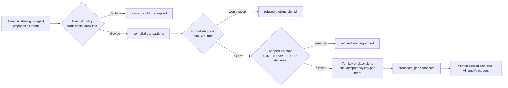

# almanak-keeperhub

[](https://github.com/Prashant-thakur77/almanak-keeperhub/actions/workflows/ci.yml)

Almanak decides. KeeperHub lands it. No strategy code changes.

## The result

Every figure below comes from a KeeperHub execution record or a transaction receipt on Base Sepolia. Nothing is
estimated. `scripts/benchmark.py` reproduces the table; `docs/benchmark.json` is its raw output.

| Measure | Result |
|---|---|
| Impossible deposits refused before broadcast | **50/50** |
| Valid dry runs through KeeperHub | 50/50 (median gas estimate 35874) |
| Real executions landed and verified | **200/200** |
| Broadcast to verified receipt | p50 7.82s, p95 11.99s |
| Retries of already-landed work | **50/50 replayed** by idempotency key, 0 double broadcasts (p50 1.27s) |
| Process killed right after broadcast | **10/10** settled by a fresh process from the receipts log, 0 resent |
| Failure modes recorded, on purpose | 7 of 7, none reached the chain except the ones meant to |
| Private keys on the machine | 0 |
| Strategy code changed | 1 line (the chain list) |
| Tests | 563 unit and property, 11 live against production every six hours, a fork rehearsal against both API generations |
| Features contributed upstream to KeeperHub | 4 issues filed, 4 accepted; 7 pull requests, **3 merged and live on production**, 4 in review (3 of them on maintainer-filed issues) |

## Judge links

| What | Where |
|---|---|
| The site: live counters, the latest runner lifecycle, the results, the video, the failure modes | https://prashant-thakur77.github.io/almanak-keeperhub/ |
| The console: every execution this project produced, KeeperHub's verdict and decoded events on each, searchable, every row a permalink | https://prashant-thakur77.github.io/almanak-keeperhub/console/ |
| Demo video | https://youtu.be/wdZJTSivzRI |
| An agent (Claude over MCP) running and verifying a tick, unedited | [`docs/agent-session.md`](docs/agent-session.md) |
| The proof refreshing itself: a strategy tick through KeeperHub every six hours, run and committed by a GitHub runner | [proof workflow runs](https://github.com/Prashant-thakur77/almanak-keeperhub/actions/workflows/proof.yml) · [`scripts/proof_tick.sh`](scripts/proof_tick.sh) |
| A real strategy tick: approve | [0x29dd40a6…5203c8](https://sepolia.basescan.org/tx/0x29dd40a6db7016bf0b75f49ef56da3b64b44e81e25e473cc6d19c7930a5203c8) · execution `az13hw7qn9y9dhs52s4rg` |
| The same tick: deposit of 5 USDC | [0x70b453be…5a7a87](https://sepolia.basescan.org/tx/0x70b453be43f4b8c4d40837baa7bd6f16fa3cc909038a590978b831b6605a7a87) · execution `au5z8vtzv8s9xm811z93j` |
| The exit, through KeeperHub | [0x91777e39…17f0a4](https://sepolia.basescan.org/tx/0x91777e39d4fc1748f632a4e73d16e2b6475781097d9682011583635fde17f0a4) · execution `7rshlqcgwoxkia3iz052b` |
| A full lifecycle run by a GitHub runner with nobody present, ending in a guarded exit KeeperHub re-checked before redeeming | [0xdf51810b…41f7d4](https://sepolia.basescan.org/tx/0xdf51810ba2851e7c4c29863e4945c41787ce8e8f0e21bca39694bf9f0541f7d4) · execution `8q6azz7iy224ef6jh8x5w` · [the run](https://github.com/Prashant-thakur77/almanak-keeperhub/actions/workflows/proof.yml) |
| A keeper run by KeeperHub's own engine, no Almanak process | [0x3e31e8c1…68cf16](https://sepolia.basescan.org/tx/0x3e31e8c1d0d66242f11929417e3aa3dc58677f6b5c205e5ae0c23b0caa68cf16) · workflow `7cloybpqfrjvjv756dd2r` |
| Upstream: raw calldata on `contract-call` | [issue #2426](https://github.com/KeeperHub/keeperhub/issues/2426) → [PR #2449](https://github.com/KeeperHub/keeperhub/pull/2449), **merged** |
| Upstream: the acting wallet on sponsored executions | [issue #2428](https://github.com/KeeperHub/keeperhub/issues/2428) → [PR #2450](https://github.com/KeeperHub/keeperhub/pull/2450), **merged** |
| Upstream: simulate a sequence against carried state | [issue #2427](https://github.com/KeeperHub/keeperhub/issues/2427) → [PR #2452](https://github.com/KeeperHub/keeperhub/pull/2452), **merged** |
| Upstream: workflow preflight against carried state | [issue #2519](https://github.com/KeeperHub/keeperhub/issues/2519) → [PR #2531](https://github.com/KeeperHub/keeperhub/pull/2531), in review |
| Upstream, from the maintainers' backlog: approve hint [#2367](https://github.com/KeeperHub/keeperhub/issues/2367), EVM chain runbook [#2497](https://github.com/KeeperHub/keeperhub/issues/2497), aggregate precision [#2496](https://github.com/KeeperHub/keeperhub/issues/2496) | [PR #2533](https://github.com/KeeperHub/keeperhub/pull/2533), [PR #2532](https://github.com/KeeperHub/keeperhub/pull/2532), [PR #2534](https://github.com/KeeperHub/keeperhub/pull/2534), in review |
| The guarded exit as a KeeperHub workflow: Condition node as the guard, run by KeeperHub's engine | workflow `zhanaalz8k47rrjspihct` · stale decision stopped at the gate `qez8b9fhipm7c4zcqa6sg` · redeem [0xc18e3c7f…2479d](https://sepolia.basescan.org/tx/0xc18e3c7fb2c9be914115d835e29042bc6593b5408e8c0f77ac64965d3282479d) `90eswt00kn44cw2szpl80` |
| Upstream to Almanak: a pluggable execution backend for the gateway, with a diff that applies to their `main` | [almanak-co/sdk#3](https://github.com/almanak-co/sdk/issues/3) |
| Every execution hash, verdict and link | [`docs/console/console-data/state.json`](docs/console/console-data/state.json), [`docs/receipts.json`](docs/receipts.json), [`docs/benchmark.json`](docs/benchmark.json) |
| Reproducible API findings, re-verified every six hours | [`docs/api-notes-verified.md`](docs/api-notes-verified.md) |
| Who can act through which gate, and what a stolen key cannot do | [`SECURITY.md`](SECURITY.md) |
| Reproduce it with no KeeperHub account: an Anvil fork plus a stand-in that speaks the merged API | `tests/e2e/rehearsal.sh --testnet` |
| The package | [PyPI `almanak-keeperhub` 1.0.0](https://pypi.org/project/almanak-keeperhub/) |

Verify any row yourself: `almanak-keeperhub verify <hash or execution id>` asks KeeperHub for its verdict and
decodes the receipt to name who acted, or open the execution in the KeeperHub app under Runs.

## Three ways to use it

| Surface | For | Start it |
|---|---|---|
| CLI | the strategy operator | `almanak-keeperhub run --once` |
| MCP server | any agent: Claude, Cursor, an n8n AI Agent | `almanak-keeperhub mcp` (read + dry run; `--write` to broadcast) |
| Telegram bot | the operator's phone | `almanak-keeperhub bot` |

All three read the same receipts and drive the same CLI, so they cannot disagree about what happened.

**In sixty seconds.** [Almanak](https://github.com/almanak-co/sdk) is a live DeFi strategy framework whose execution layer is three abstract classes: sign, simulate, submit. This package implements all three against KeeperHub, so every Almanak strategy, unmodified, dry-runs through KeeperHub, broadcasts with one idempotency key per intent, and gets a verified receipt back into Almanak's own parsers, with no private key on the machine. Verified on the hosted app on Base Sepolia on 12 Sep 2026: the packaged demo strategy's [deposit](https://sepolia.basescan.org/tx/0x70b453be43f4b8c4d40837baa7bd6f16fa3cc909038a590978b831b6605a7a87), a KeeperHub-scheduled keeper generated from the strategy config and [run by KeeperHub's own engine](https://sepolia.basescan.org/tx/0x3e31e8c1d0d66242f11929417e3aa3dc58677f6b5c205e5ae0c23b0caa68cf16), the [redeem](https://sepolia.basescan.org/tx/0x91777e39d4fc1748f632a4e73d16e2b6475781097d9682011583635fde17f0a4), seven deliberate failure modes, and a benchmark (50 of 50 impossible deposits refused before broadcast, 200 of 200 approvals landed and verified at a median of 7.8 s, 50 of 50 retries replayed and 10 of 10 crashed processes resumed without a second broadcast). Everything cost nothing: gas sponsored by KeeperHub, faucet USDC. Proof table below; live console and Telegram operator bot included.

[Almanak](https://github.com/almanak-co/sdk) is an open-source DeFi strategy framework (PyPI `almanak`, Apache-2.0, 46 protocol connectors). Its execution layer is built around three abstract classes, `Signer`, `Submitter` and `Simulator`, so that "multiple signing backends and submission methods" can be plugged in (`almanak/framework/execution/interfaces.py`). Today the only submitter that ships is the public mempool, and the private-relay submitter is a stub that rejects every transaction.

This package implements all three against [KeeperHub](https://keeperhub.com)'s Direct Execution API. Every Almanak strategy, unchanged, then runs like this:

1. Almanak compiles the strategy's intent into transactions (approve, deposit, swap...).
2. `KeeperHubSimulator` dry-runs the bundle through KeeperHub (`simulate: true`). A revert stops the tick before anything is signed.
3. `KeeperHubSigner` decodes each transaction's calldata into the function call KeeperHub executes and derives one idempotency key per piece of work. No private key exists on the machine; KeeperHub's Turnkey wallet signs.
4. `KeeperHubSubmitter` broadcasts through KeeperHub with that key, waits for the verified receipt, and hands Almanak a normal `TransactionReceipt` with logs, so Almanak's own receipt parsers and position tracking keep working.

## The incident this prevents

Almanak's repository documents it (`almanak/framework/execution/nonce_recovery.py`):

> Arbitrum mainnet 2026-05-18, lp_triple strategy. LP_OPEN C's mint at nonce 1635 actually landed on-chain, but the framework raised NONCE_ERROR on a follow-up read, retried, minted a duplicate dust position, and teardown closed only the tracked positions. NFT 5495063 became a zombie position the framework didn't track. Manual recovery via direct cast calls.

With KeeperHub in the loop the retry carries the same idempotency key, so KeeperHub replays the first execution instead of broadcasting again. `demos/failure_modes/duplicate_blocked_by_idempotency.py` reproduces the "landed but retried" sequence on purpose.

## Run it in five minutes

On PyPI as [`almanak-keeperhub`](https://pypi.org/project/almanak-keeperhub/): `pip install 'almanak-keeperhub[mcp]'`
gives you every command below and the MCP server. For the demos, tests and scripts, clone the repo:

```bash
git clone https://github.com/Prashant-thakur77/almanak-keeperhub && cd almanak-keeperhub
uv venv --python 3.12 && source .venv/bin/activate
uv pip install -e ".[dev]"
cp .env.example .env            # KEEPERHUB_API_KEY (mcp:write), Base RPC URL
set -a; source .env; set +a

almanak-keeperhub doctor --chain base           # key, org wallet + balances, chain, selector index
cd demos/metamorpho_base_yield
almanak-keeperhub run --once --dry-run          # Almanak plans; nothing reaches the gateway
almanak-keeperhub run --once --simulate-only    # KeeperHub dry-runs the compiled bundle; nothing broadcast
almanak-keeperhub run --once                    # 5 USDC into the Moonwell Flagship USDC vault via KeeperHub
```

Or run the whole sequence, failure modes included: `scripts/first_run.sh`.

## The free path: Base Sepolia

Almanak ships no testnet chain: its "sepolia" network mode swaps the RPC but keeps the mainnet chain id in every compiled transaction, which would hand KeeperHub a mainnet transaction. `almanak_keeperhub/testnet.py` fixes that at the root: it registers `base_sepolia` (chain id 84532) as a first-class Almanak chain, teaches Almanak's token resolver the testnet's ETH, WETH and Circle's test USDC, and lets the ERC-4626 vault connector compile there. The unmodified demo strategy then runs on Base Sepolia through KeeperHub with sponsored gas:

```bash
scripts/deploy_test_vault.sh --rpc https://sepolia.base.org --private-key 0x...   # once; ~0.0005 Sepolia ETH from a faucet
python scripts/testnet_config.py 0x<vault>                                         # writes it into demos/metamorpho_base_sepolia/config.json
cd demos/metamorpho_base_sepolia
almanak-keeperhub doctor --chain base_sepolia
almanak-keeperhub run --once --fresh --simulate-only
almanak-keeperhub run --once --fresh                  # approve + deposit 5 test USDC into the TestVault, chain id 84532
almanak-keeperhub keeper deploy && almanak-keeperhub keeper enable
ALMANAK_KEEPERHUB_CHAIN=base_sepolia python ../failure_modes/crash_and_resume.py    # every demo and the benchmark take the same switch
```

`contracts/TestVault.sol` is a dependency-free 1:1 ERC-4626 over the test USDC, the stand-in for the Moonwell vault. The one-line difference in `demos/metamorpho_base_sepolia/strategy.py` is the declared chain list (see its README). What stays mainnet-only: the strategy-decided exit tick (the strategy reads a Morpho Blue rate that does not exist on Sepolia, and a missing rate holds rather than exits) and the `ax` swap (no swap venue on Sepolia). On Sepolia `scripts/redeem_all.py` closes the position through KeeperHub instead (dry run, idempotent broadcast, verified receipt), which also returns the test USDC to the wallet. `tests/e2e/rehearsal.sh --testnet` runs the whole free path on a Base Sepolia fork.

Cost of the free path: zero. Faucet ETH for the single vault deploy, faucet USDC from https://faucet.circle.com, and KeeperHub sponsors gas on Base Sepolia. `scripts/track_a.sh` runs all of it: it generates a throwaway deployer key, waits for the two faucets, deploys the vault, and runs every step above plus the demos, the benchmark and the API-notes reproduction.

## Execution console

`almanak-keeperhub console` serves a local page over the proof files and keeps it live while the terminal runs: every execution with KeeperHub's status and verified flag, every dry run (including `--simulate-only` ticks), the failure-mode verdicts, and the benchmark. Inspect asks KeeperHub for its verdict and decodes the receipt events to show who acted, even when the relayer paid the gas. Nothing on the page is typed in by hand; every row is read from a file the run wrote.


```bash
almanak-keeperhub console            # http://127.0.0.1:8642, opens a browser; --no-open for headless
```

No framework and no build step: one HTML file served by the standard library's HTTP server, with the package's own client behind the Inspect endpoint. Open it beside the terminal for the demo.

`almanak-keeperhub console --export docs` writes the same page as a static site with every execution's
evidence frozen next to it, under `console/`, plus a front page at the root with live counters, the latest
lifecycle, the results and the video, all read from the same `state.json`; that is what
https://prashant-thakur77.github.io/almanak-keeperhub/ serves. Every console row is a permalink
(`console/#<execution id>`) and the console searches by id, hash, contract or function.
That site does not wait for a human: `.github/workflows/proof.yml` runs `scripts/proof_tick.sh` on a GitHub
runner every six hours, which puts the demo strategy through one full lifecycle on Base Sepolia (Almanak plans,
KeeperHub dry-runs, approve and deposit land, the position is redeemed so the test USDC comes back), merges
every receipts log into `docs/all-receipts.json`, re-exports the console keeping the verdicts already frozen,
and commits the result. The newest rows on the console were made by that runner, and the commit that added
them is signed `proof-tick`.

To show a judge who acted when KeeperHub's relayer paid the gas:

```bash
almanak-keeperhub verify 0x<tx hash or execution id>
# KeeperHub execution : 2e3b...   status: completed  sponsored=True
# receipt             : 0xee48... verified=True receiptStatus=success
# on-chain sender     : 0x3b2e... = KeeperHub's relayer (sponsored gas), not the org wallet
# event               : Deposit at 0xc125...: sender=<org> owner=<org> assets=5000000 shares=... -> actor is org wallet
```

Every run ends with a proof summary and appends to `keeperhub-receipts.json` in the strategy directory (dry runs are recorded there too, so a simulate-only tick leaves a trace):

```
KeeperHub executions this run (2), recorded in .../demos/metamorpho_base_yield/keeperhub-receipts.json:
  approve -> 0x833589fcd6edb6e08f4c7c32d4f71b54bda02913  execution=b0c3...  status=completed verified=True
    tx 0x7970a839...  https://basescan.org/tx/0x7970a839...
  deposit -> 0xc1256Ae5FF1cf2719D4937adb3bbCCab2E00A2Ca  execution=2e3b...  status=completed verified=True
    tx 0xee489263...  https://basescan.org/tx/0xee489263...
```

`--simulate-only` is the orchestrator-level dry run: Almanak compiles the exact bundle, KeeperHub simulates it, the signer prepares it, and the pipeline stops before submission. It runs against a throwaway state store, so it leaves no footprint on the strategy (Almanak strategies move their own state optimistically when they emit an intent).

Almanak's own agent CLI runs through the same backend. `almanak ax` compiles an agent's decision (structured or natural language) into transactions and executes them through the gateway, so with the KeeperHub servicer installed the agent decides and KeeperHub executes:

```bash
almanak-keeperhub ax --chain base swap USDC WETH 1 --dry-run     # agent plans, KeeperHub simulates, nothing sent
almanak-keeperhub ax --chain base swap USDC WETH 1 --yes         # Uniswap v3 exactInputSingle through KeeperHub
almanak-keeperhub ax --chain base -n "swap 1 USDC to WETH"       # natural language; needs AGENT_LLM_API_KEY
```

The whole position lifecycle runs through KeeperHub. `config.exit.json` raises the strategy's APY floor above any live rate, so the next tick decides to leave:

```bash
almanak-keeperhub run --once --fresh                        # approve + deposit
almanak-keeperhub run --once -c config.exit.json            # EXIT: APY 4.2% < floor 50% -> redeem, back to idle
```

## The exit that KeeperHub double-checks

Almanak decides to leave a vault on a snapshot of the position. Between that decision and the broadcast the
position can change: the keeper compounded, another process already redeemed, a retry is replaying an exit
that landed. `almanak-keeperhub exit` sends the redeem as KeeperHub's `check-and-execute`: KeeperHub reads
`balanceOf(wallet)` itself right before the write and runs `redeem(shares)` only if the balance still covers
it. A stale decision comes back `executed: false` with the observed balance, recorded as a refusal, and
nothing is broadcast. The idempotency key identifies the decision, not the shape: the first scheduled run
taught that lesson, when a key made of (vault, wallet, shares) collided with an earlier same-size exit and
KeeperHub replayed it instead of redeeming. The guard is what prevents a double redeem; the key only covers
an immediate retry of one decision.

```
$ almanak-keeperhub exit --simulate         # guard holds: executed True, status simulated, nothing signed
$ almanak-keeperhub exit                    # executed True, execution dixwqqavpw77vpqsftrt7, tx 0x11217e29..., completed
$ almanak-keeperhub exit --expect-shares 5000000   # the same decision again, position already closed:
executed          : False
guard             : balanceOf(0xe7dbacbd...36ac9) gte 5000000
observed          : 0
```

Those three are a real sequence on Base Sepolia on 15 Sep 2026; the proof tick runs the guarded exit every
six hours, and `exit_position` exposes it to an agent over MCP.

### The same guard as a KeeperHub workflow

`almanak-keeperhub exit-guard` expresses the same decision in KeeperHub's own builder, so the guard is a
Condition node anyone can read and the run is a workflow execution by KeeperHub's engine, with no Almanak
process involved: a Manual trigger carries the decision (how many shares), a balance node reads the wallet's
vault shares, a Condition compares them, and a Morpho `vault-redeem` sits behind the true branch. A decision
the position no longer covers stops at the Condition: the execution completes, the redeem node is never
reached, nothing is broadcast.

```
$ almanak-keeperhub exit-guard deploy                       # creates the workflow, KeeperHub validates it: valid=True, 0 warnings
$ almanak-keeperhub exit-guard run --expect-shares 5000001  # stale decision, wallet holds 5000000:
executed          : False
observed          : 5000000
note              : stopped at the Condition; the redeem node was never reached and nothing was broadcast
$ almanak-keeperhub exit-guard run                          # current decision: executed True, tx 0xc18e3c7f..., verified
```

That is a real sequence on 22 Sep 2026: workflow `zhanaalz8k47rrjspihct`, executions `qez8b9fhipm7c4zcqa6sg`
(stopped at the gate, 3.7 s) and `90eswt00kn44cw2szpl80` (redeemed, 8.4 s). Direct execution and workflow are
the two ways KeeperHub offers to act with a guard; the integration generates both from the same strategy, and
the workflow one is what a team already living in the builder would reach for.

## The keeper: a scheduled KeeperHub workflow generated from the strategy

Almanak decides entry and exit on its own tick. Between ticks, or when no Almanak process is running at all, a KeeperHub workflow keeps small idle balances working. `almanak-keeperhub keeper` generates it from the strategy's `config.json` (vault, token, chain), creates it in KeeperHub, validates it, and enables it on request:

```bash
almanak-keeperhub keeper show      # the workflow JSON: Schedule -> idle balance -> Condition -> approve -> vault deposit
almanak-keeperhub keeper deploy    # POST /api/workflows/create, then GET /validate; created disabled
almanak-keeperhub keeper enable    # PATCH enabled; KeeperHub's scheduler runs it from here
almanak-keeperhub keeper run       # POST /execute: fire it now and follow the run (what the proof table shows)
almanak-keeperhub keeper status    # GET /api/workflows/{id}/executions
```

The keeper only moves balances inside a bounded window (1 to 90 USDC by default). Anything larger is left for the strategy to size, which keeps the two layers from fighting. It uses free-tier nodes only (the Code, HTTP request and Send Webhook nodes need a Pro plan; checked against `GET /api/action-schemas` on the hosted app). The generated JSON passes KeeperHub's hosted validator (`GET /api/workflows/{id}/validate?deepCheck=true`, recorded in `keeperhub-keeper.json`) and its structural validator in `tests/e2e/keeperhub-validator/`, which runs inside a KeeperHub checkout against `docs/keeper-workflow.json`.

## Two policy layers, both refusing

The strategy, or Almanak's AI agent, only ever proposes. Nothing it says can turn into a broadcast without passing
two independent gates it does not control, and the private key sits behind the second one, in an enclave.



Almanak's agent policy refuses before anything is compiled; KeeperHub's caps refuse before anything is signed. [`SECURITY.md`](SECURITY.md) is the full model: who can act through which gate, what the package refuses on its own, what a stolen key can and cannot do. Both gates are demonstrated:

```bash
almanak-keeperhub ax --chain base --max-trade-usd 0.5 swap USDC WETH 1 --yes
# Policy denied 'swap_tokens': Estimated trade value $1.00 exceeds single-trade limit $0.5.  (no KeeperHub call)
python demos/failure_modes/cap_refused.py
# Stablecoin transfer of 150 USDC exceeds the 100.0 USD per-transaction limit          (KeeperHub, nothing signed)
```

The demo strategy in `demos/metamorpho_base_yield/` is Almanak's own packaged demo, copied unmodified from the `almanak` package (Apache-2.0). Only `config.json` differs: the deposit is 5 USDC instead of 50. Fund the KeeperHub organization wallet with at least 6 USDC and a little ETH on Base first.

`almanak-keeperhub run` accepts every `almanak strat run` flag. It sets `ALMANAK_GATEWAY_WALLETS` for the strategy's chain, installs the KeeperHub gateway servicer, and hands over to Almanak's own `strat run`.

## Where it plugs in

```
almanak strat run (unchanged)
  │  gRPC
  ▼
Almanak gateway (in-process)  ── wallet registry plugin: almanak.wallets entry point
  ExecutionServiceServicer      ── kind "keeperhub" → KeeperHubSigner (address = org wallet)
    └─ ExecutionOrchestrator    ── submitter → KeeperHubSubmitter, simulator → KeeperHubSimulator
         build → validate → SIMULATE → sign → SUBMIT → CONFIRM → parse receipts
                              │                 │           │
                              ▼                 ▼           ▼
                   POST /api/execute/contract-call   GET /api/execute/{id}/status
                   {simulate:true}   Idempotency-Key      receipts[].verified
```

Files:

| File | Role |
|---|---|
| `almanak_keeperhub/client.py` | Direct Execution API client: simulate, execute with `Idempotency-Key`, status polling honouring `X-Poll-Interval-Hint`, typed errors |
| `almanak_keeperhub/calldata.py` | Offline selector index (ABIs shipped in the `almanak` package plus `signatures.json`). Unknown selectors are refused, never guessed |
| `almanak_keeperhub/signer.py` | `Signer`: decode calldata, derive the idempotency key, no local key |
| `almanak_keeperhub/submitter.py` | `Submitter`: sequential broadcast, confirmation between dependent transactions, receipts with logs |
| `almanak_keeperhub/simulator.py` | `Simulator`: KeeperHub dry run of the first transaction, compiler gas for dependent ones (same rule as Almanak's own simulator) |
| `almanak_keeperhub/wallets.py` | Almanak `almanak.wallets` registry plugin resolving every chain to the KeeperHub org wallet |
| `almanak_keeperhub/gateway.py` | Subclass of Almanak's execution servicer that swaps the three interfaces; `install()` |
| `almanak_keeperhub/cli.py` | `almanak-keeperhub run`, `ax`, `verify`, `console`, `keeper`, `bot` and `doctor` |
| `almanak_keeperhub/keeper.py` | Generates, deploys, enables and reads the scheduled compounder workflow |
| `almanak_keeperhub/notify.py` | Optional Telegram alerts on broadcast, settlement and refusals |
| `almanak_keeperhub/bot.py` | The Telegram operator bot: status, executions, keeper, verify, simulate, tick, demos |
| `almanak_keeperhub/mcp_server.py` | The same tools over MCP for Claude, Cursor or an n8n agent; broadcast only with `--write` |
| `almanak_keeperhub/testnet.py` | Registers `base_sepolia` as an Almanak chain, its tokens, and the vault connector on it |
| `almanak_keeperhub/demo_targets.py` | Chain switch for the demos and the benchmark (`ALMANAK_KEEPERHUB_CHAIN`) |
| `contracts/TestVault.sol` | Dependency-free ERC-4626 test vault for Base Sepolia |
| `almanak_keeperhub/console/` | The execution console: `server.py` (state over the proof files, verify endpoint) and `index.html` |
| `almanak_keeperhub/verify.py` | Decodes Transfer, Approval, Deposit and Withdraw events to name the acting wallet |
| `almanak_keeperhub/receipts.py` | Append-only record of every execution; also the resume table after a crash |
| `patches/` | The upstream proposal for Almanak (same change, without the subclass) |

Idempotency key: `sha256(v2 | chain_id | from | to | data | value | almanak intent id)`. Almanak assigns a fresh nonce on every attempt, so the nonce is deliberately not part of the key: a retry of the same intent reproduces it and KeeperHub replays the first execution. The intent id (the execution context's correlation id) separates two intents that compile to identical calldata within KeeperHub's 24-hour replay window. Set `ALMANAK_KEEPERHUB_IDEMPOTENCY_SALT` for a deliberate repeat outside an orchestrated run.

## The loop closed: what this project fixed upstream, it now uses

The two hardest limits met while building this were KeeperHub's, not Almanak's: no raw calldata on
`contract-call`, and a dry run that could not see the state an earlier call produces. Both were filed as
issues, accepted, built to the maintainers' spec and merged into KeeperHub. The client here already speaks
both shapes: `ContractCall` carries the typed and the raw spelling, `KeeperHubSimulator` offers a bundle as
a sequence, and each capability latches from the API's own answer, so nothing is configured and nothing
breaks on the deployment that has not caught up yet. `almanak-keeperhub api-features` asks the live API,
the proof tick records the answer in `docs/api-features.json` every six hours, and the console footer
prints it. That day came on 16 Sep 2026, two days before the deadline: production started answering yes to
both, the runner's next tick dry-ran its bundle as a sequence on `eth_simulateV1`, and nothing in this
repository had to change.

## KeeperHub surfaces used

| Surface | Used | How |
|---|---|---|
| Direct execution REST | yes | `POST /api/execute/contract-call` with `simulate: true`, then with `Idempotency-Key`; `GET /api/execute/{id}/status`; raw `data` and `calls[]` sequences the moment production deploys them |
| Check and execute | yes | `almanak-keeperhub exit`: the vault exit as `POST /api/execute/check-and-execute`, KeeperHub reading the balance right before the redeem and refusing a stale decision with `executed: false` |
| Audit trail | yes | every execution id, hash, verified flag and link recorded in `keeperhub-receipts.json`, printed at the end of each run, plus the Runs page in the app |
| Agent-authored workflows | yes | `almanak-keeperhub keeper` generates a Schedule-triggered workflow from the strategy config and creates it through `POST /api/workflows/create`; KeeperHub's scheduler runs it with no Almanak process |
| Agent-authored execution | yes | Almanak's `ax` agent (structured or natural language) decides; KeeperHub executes the compiled transactions |
| MCP | as a server | Almanak's execution layer is Python inside a gRPC gateway, so it consumes REST; the other direction is `almanak-keeperhub mcp`, which serves the strategy's proof and controls to any MCP client with the same read/write split as KeeperHub's own keys |
| CLI (`kh`) | no | not needed by the integration |
| x402 / MPP | no, deliberately | this executes a framework's own transactions; nothing here is sold per call |

## MCP server: the strategy as tools for any agent

`almanak-keeperhub mcp` serves the same proof and controls to any MCP client: Claude Desktop, Claude Code,
Cursor, an n8n AI Agent. An agent can read every execution with KeeperHub's verified receipt, ask KeeperHub for
its verdict on a hash, dry-run a strategy tick, and replay the failure modes. Broadcasting is off unless the
server is started with `--write`, the same split as KeeperHub's own `mcp:read` and `mcp:write` keys, so an agent
given the default server can inspect and simulate everything and sign nothing.

```bash
pip install 'almanak-keeperhub[mcp]'
cd demos/metamorpho_base_sepolia && almanak-keeperhub mcp --chain base_sepolia          # read + dry run
cd demos/metamorpho_base_sepolia && almanak-keeperhub mcp --chain base_sepolia --write  # adds run_tick
```

| Tool | What it does | Touches the chain |
|---|---|---|
| `status` | org wallet, chain, counts, keeper state, whether broadcast is enabled | no |
| `list_executions`, `list_dry_runs` | the recorded executions and dry runs, newest first, with links | no |
| `verify <hash or execution id>` | KeeperHub's verdict, the receipt, and who acted decoded from the events | reads |
| `benchmark`, `failure_modes`, `keeper` | the recorded benchmark, the six failure-mode verdicts, the compounder workflow | no |
| `simulate_tick` | one strategy tick, dry-run through KeeperHub | dry run only |
| `run_failure_demo <revert\|cap\|duplicate\|crash\|selector\|rpc\|stale>` | replay one failure mode | dry run, or a refused broadcast |
| `run_tick` (`--write` only) | one real tick: sign and broadcast through KeeperHub; needs `confirm=true`; starts from a fresh strategy state (`fresh=false` to continue Almanak's saved state) | broadcasts |
| `exit_position` (`--write` only) | the guarded exit: KeeperHub re-reads the balance, redeems only if it still covers it; needs `confirm=true` | broadcasts, or refuses |

Resource `almanak-keeperhub://receipts` is the raw receipts log. Claude Desktop / Cursor config:

```json
{ "mcpServers": { "almanak-keeperhub": {
    "command": "almanak-keeperhub",
    "args": ["mcp", "-d", "/path/to/demos/metamorpho_base_sepolia", "--chain", "base_sepolia"],
    "env": { "KEEPERHUB_API_KEY": "kh_...", "ALMANAK_BASE_SEPOLIA_RPC_URL": "https://sepolia.base.org" } } } }
```

The tools are the bot's handlers behind an MCP surface (`almanak_keeperhub/mcp_server.py`, `StrategyTools`),
so the phone, the console and the agent can never disagree about what happened.

### An agent at the controls, recorded

[`docs/agent-session.md`](docs/agent-session.md) is three real Claude sessions over this server, captured
headless by `scripts/agent_session.py` and rendered without editing. Given the read-only server and told to
run a real tick, the agent reports `broadcast_enabled: false`, finds no `run_tick` tool, and stops. Given the
`--write` server, its first tick came back `HOLD` (the strategy still remembered a position that had been
redeemed through KeeperHub outside Almanak; `run_tick` now starts fresh by default for that reason) and the
agent said so instead of claiming a deposit. Started fresh, it lands approve `389lzsqaq40606gy396hr` and deposit `mgwqs6texgo4xpzvu3j4j`, both sponsored and verified, then
calls `verify` and reads off the receipt that the transaction sender is the sponsor's relayer while every
Transfer, mint and Deposit event names the org wallet: the agent decided, KeeperHub executed, and the agent
could prove who acted. Its first recording also found a bug in this package (`list_dry_runs` answered with an
empty list), fixed the same hour.

## Telegram operator bot (optional)

`almanak-keeperhub bot -d demos/metamorpho_base_sepolia` runs a Telegram bot that answers only its owner's chat (the first chat that sends `/start` claims it, and the bot prints the chat id to put in `.env`). Read commands answer from the same proof files as the console; action commands run the CLI in a subprocess and post the summary:

| Command | What it does |
|---|---|
| `/status` | org wallet, chain, execution and dry-run counts, keeper state |
| `/executions [n]` | latest executions with status, verified and sponsored flags, explorer links |
| `/dryruns` | latest KeeperHub dry runs and their verdicts |
| `/keeper` | the scheduled compounder workflow and its KeeperHub executions |
| `/verify <hash or execution id>` | KeeperHub's verdict, the on-chain sender, and the events naming the org wallet |
| `/simulate` | one strategy tick dry-run through KeeperHub, nothing broadcast |
| `/tick` then `/confirm` | one real strategy tick; the confirmation expires after 60 seconds |
| `/exit` then `/confirm` | the guarded exit: KeeperHub re-reads the position and redeems only if it still holds |
| `/demo revert\|cap\|duplicate\|crash\|selector\|rpc` | run a failure-mode demo and post its verdict |

Long polling over the Bot API with no webhook and no public endpoint. Set `ALMANAK_KEEPERHUB_TELEGRAM_BOT_TOKEN` (from @BotFather); the alerts below use the same token.

## Operator alerts (Telegram, optional)

KeeperHub's workflows have a Telegram node (free tier), but this integration executes through the direct-execution API where no workflow node runs, so the alert is sent from the backend itself: one message per broadcast, settlement or refusal (dry-run revert, cap, guard), with the explorer link. Set `ALMANAK_KEEPERHUB_TELEGRAM_BOT_TOKEN` and `ALMANAK_KEEPERHUB_TELEGRAM_CHAT_ID` (see `.env.example`); unset means silent, and a failed send never affects execution.

## Failure and recovery, from the logs

Two things happened during the fork rehearsal that were not planned and are kept because they show the backend doing its job.

The duplicate demo left a 0.01 USDC allowance to the vault. On the next strategy tick Almanak's compiler applied USDC's approve-zero-first rule, so the bundle became three transactions instead of two. The submitter sent them one at a time, waiting for each verified receipt before the next:

```
KeeperHub execution 62d4ae96... broadcast tx 0x481a6b66... (completed)   approve(vault, 0)
KeeperHub execution 43f4d751... broadcast tx 0x272c0f2d... (completed)   approve(vault, 5000000)
KeeperHub execution a761b41d... broadcast tx 0x41f6f46b... (completed)   deposit(5000000, org)
Status: SUCCESS | Intent: VAULT_DEPOSIT | Gas used: 437819
```

The crash demo kills the process right after broadcast. The next process is handed only the hash:

```
child broadcast 0x18c91989... and exited with 0 before any receipt was read
resumed execution 809aa4af... from .../keeperhub-receipts.json
receipt status=1 block=51186612 gas_used=46199
no second broadcast was needed: the hash was settled by a process that never sent it.
```

## Reproducible API notes

`docs/keeperhub-feedback.md` lists what was learned building against the API. `scripts/verify_api_notes.py` reproduces each finding in one command with expected versus actual, and reports a finding as fixed when it no longer reproduces, so the notes cannot go stale.

## The failure other builders hit

During this hackathon a builder reported [KeeperHub/keeperhub#2374](https://github.com/KeeperHub/keeperhub/issues/2374): a repay reported `failed` while the transaction had landed, and an agent that trusted the status retried and repaid twice. The channel's conclusion was the design this backend already ships: the idempotency key binds to the intent, not to the observation; a reported failure that carries a hash is unconfirmed with the hash retained, never "failed"; and the receipt's truth comes from the chain, or from KeeperHub's verified copy when the local RPC lags. `demos/failure_modes/crash_and_resume.py` and the duplicate demo are those rules, run on purpose.

## What we got wrong first

The first idempotency key included the nonce Almanak assigns to a transaction. An independent review showed Almanak assigns that nonce per attempt, so a genuine retry after a landed transaction would have produced a new key, which is the exact failure the README claims to prevent. The key is now the intent id plus the transaction fields (`almanak_keeperhub/signer.py`), and the duplicate demo proves it by changing the nonce on the retry. The same review found a truncated bundle could read as success and that a transport error rotated nothing but still halted the strategy; both fixed, all in `git log`.

Two more came from the last day, each caught by a machine rather than a reader:

- The guarded exit's first idempotency key was (vault, wallet, shares). The first scheduled run redeemed a position of the same size as one closed hours earlier, KeeperHub replayed that earlier execution, and the position stayed open. The key now carries the decision id; the guard is what prevents a double redeem.
- Almanak's CLI loads the repository's `.env` on its own. The fork rehearsal pinned its API key and base URL but not the wallet, so once `.env` gained `KEEPERHUB_WALLET_ADDRESS` for the console, Almanak compiled the fork's deposit with the production wallet as receiver while the stand-in signed as the fork's: the shares went to an address the rehearsal did not control and the final balance check failed. `resolve_wallet_address` now refuses an explicit wallet that disagrees with the one the API signs as, and the rehearsal pins every KeeperHub variable.

## Failure modes, on purpose

Each script uses the same signer, simulator and submitter the gateway uses.

| Script | What happens |
|---|---|
| `demos/failure_modes/revert_caught_by_dry_run.py` | Deposit far above balance: KeeperHub simulate answers `wouldRevert`, Almanak stops at SIMULATION, zero broadcasts |
| `demos/failure_modes/duplicate_blocked_by_idempotency.py` | The same compiled approve submitted twice: same execution id, same hash, `idempotentReplay: true`, one transaction on chain |
| `demos/failure_modes/cap_refused.py` | 150 USDC transfer: refused by KeeperHub's 100 USD per-transaction stablecoin cap, `submitted=False`, nothing signed |
| `demos/failure_modes/rpc_outage.py` | Dead local RPC: the broadcast still lands through KeeperHub's RPC pool; only the local log fetch fails, and says so |
| `demos/failure_modes/unknown_selector_refused.py` | Calldata with an unknown selector is handed to KeeperHub as raw bytes to decode against the verified ABI, or refused before signing on a KeeperHub that takes no raw calldata; never guessed, never broadcast |
| `demos/failure_modes/stale_exit_not_executed.py` | An exit decided for more shares than the wallet holds: KeeperHub's check-and-execute reads the balance first, answers `executed: false` with what it observed, nothing broadcast |
| `demos/failure_modes/crash_and_resume.py` | A child process broadcasts and dies before settlement; a fresh process is handed only the hash (what Almanak's runner does on restart), resumes the KeeperHub execution from `keeperhub-receipts.json`, and settles it without a second broadcast |

## Proof

`demos/metamorpho_base_yield/keeperhub-receipts.json` is written by the strategy run and `docs/receipts.json` by the failure-mode demos: execution ids, hashes, verified flags and explorer links from app.keeperhub.com.

`scripts/benchmark.py` measures the backend the way judges compare it: impossible deposits refused before broadcast, valid dry runs, real approvals landed and verified, retry replayed instead of resent, p50 and p95 latency. It writes `docs/benchmark.md`.

Proof from the hosted app on Base Sepolia (12 Sep 2026), all executed by KeeperHub from the organization wallet `0xe7Db…6Ac9` with sponsored gas:

| What | Link |
|---|---|
| Test vault (ERC-4626 over Circle's test USDC) | https://sepolia.basescan.org/address/0xd36E12a5b2926A5cbE6B4DE42a0D60Fd35d3cb04 |
| Strategy tick, approve (KeeperHub execution `az13hw7qn9y9dhs52s4rg`) | https://sepolia.basescan.org/tx/0x29dd40a6db7016bf0b75f49ef56da3b64b44e81e25e473cc6d19c7930a5203c8 |
| Strategy tick, deposit of 5 USDC (execution `au5z8vtzv8s9xm811z93j`) | https://sepolia.basescan.org/tx/0x70b453be43f4b8c4d40837baa7bd6f16fa3cc909038a590978b831b6605a7a87 |
| Keeper workflow, created through the API, validated by KeeperHub's hosted validator | workflow `7cloybpqfrjvjv756dd2r` (`demos/metamorpho_base_sepolia/keeperhub-keeper.json`); its schedule is off after the proof run so faucet USDC stays available for strategy ticks, `almanak-keeperhub keeper run` fires it on demand |
| Keeper workflow run by KeeperHub's own engine (`keeper run`, five steps, no Almanak process): approve then deposit of 15 idle USDC | https://sepolia.basescan.org/tx/0x3e31e8c1d0d66242f11929417e3aa3dc58677f6b5c205e5ae0c23b0caa68cf16 |
| Redeem of the whole position through KeeperHub (`scripts/redeem_all.py`, the free path's exit) | https://sepolia.basescan.org/tx/0x91777e39d4fc1748f632a4e73d16e2b6475781097d9682011583635fde17f0a4 |
| Duplicate demo: same intent submitted twice, one transaction, second answer `idempotentReplay` | https://sepolia.basescan.org/tx/0x965fa66afab02671772d282258c65df27cb7d10cb2b314d15ff949e0b6e30c2a |
| Every execution with id, status, verified flag | `demos/metamorpho_base_sepolia/keeperhub-receipts.json`, `demos/failure_modes/keeperhub-receipts.json`, `docs/receipts.json` |

On the explorer the sender is KeeperHub's relayer (`0x6331…1E99`, sponsored gas) and the target is its relay contract; the Approval and Deposit events name the organization wallet. `almanak-keeperhub verify <hash> --chain base_sepolia` prints both sides.

Measured against the hosted app (`docs/benchmark.md`):

| Measure | Result |
|---|---|
| Impossible deposits refused before broadcast | 20/20 |
| Valid approve dry runs succeeded | 10/10 (median gas estimate 38680) |
| Real approvals landed and verified | 5/5 |
| Broadcast + verified receipt latency | p50 6.88s, p95 9.59s |
| Simulate latency | p50 0.36s, p95 0.41s |
| Retry of already-landed work replayed, not resent | True (0.3s) |

Findings reproduced against the hosted API in one command (`docs/api-notes-verified.md`): no raw-calldata write (HTTP 400, `functionName` required), the brief's MCP docs link redirects (308), `network` outranks `chainId` on contract-call.

Filed upstream on 12 Sep 2026: [KeeperHub/keeperhub#2426](https://github.com/KeeperHub/keeperhub/issues/2426) accept raw calldata on contract-call (the PR with tests is on [`feat/raw-calldata-contract-call`](https://github.com/Prashant-thakur77/keeperhub/tree/feat/raw-calldata-contract-call)), [#2427](https://github.com/KeeperHub/keeperhub/issues/2427) chained simulation for bundles, [#2428](https://github.com/KeeperHub/keeperhub/issues/2428) the acting wallet on sponsored executions.

`docs/rehearsal-fork.md` is the log of the same pipeline on an Anvil fork of Base against a local stand-in for KeeperHub (`tests/e2e/fake_keeperhub.py`, which mirrors the documented API shapes). It proves the wiring; it is not execution through KeeperHub.

## Try it without a KeeperHub account

`tests/e2e/rehearsal.sh` starts an Anvil fork of Base and a local stand-in for the KeeperHub API (`tests/e2e/fake_keeperhub.py`, the documented request and response shapes, signing with a throwaway Anvil key), then runs doctor, the failure modes, a simulate-only tick, a real tick of the unmodified demo strategy, the keeper, the benchmark with a crash cycle, the guarded exit and its stale replay, and asserts the final balances on the fork. The stand-in speaks the merged API (raw `data` decoded losslessly, `calls[]` dry-run on an Anvil snapshot so each call sees the previous one's state, `check-and-execute`); `KEEPERHUB_FAKE_API=legacy` makes it answer like production before those changes, which rehearses the fallbacks. Needs foundry and a Base RPC. It proves the wiring; it is not execution through KeeperHub.

## Tests

```bash
pytest -q                      # 563 unit and property tests; the live suite skips unless opted in
ALMANAK_KEEPERHUB_LIVE=1 pytest -q tests/live   # 11 documented API behaviours, checked against app.keeperhub.com
ruff check almanak_keeperhub tests scripts && mypy almanak_keeperhub --ignore-missing-imports
tests/e2e/rehearsal.sh         # Base mainnet fork + stand-in: full lifecycle, agent swap, keeper, benchmark
tests/e2e/rehearsal.sh --testnet  # Base Sepolia fork: the free path end to end
```

Four layers, each answering a different question:

| Layer | What it checks | Count |
|---|---|---|
| Unit | API shapes from KeeperHub's docs (respx), the decoder, the adapters against Almanak's real `Signer`/`Submitter`/`Simulator` interfaces, the console, the MCP server, the bot | 159 |
| Property (hypothesis) | every one of the 339 signatures in the selector index decodes losslessly under random arguments; trailing bytes and unknown selectors are always refused; the idempotency key identifies work, never the attempt; ether strings are exact at any magnitude | 404 |
| Live conformance | one test per sentence of the Direct Execution docs, against production: replay by key, conflict on a changed body, verified receipt, sponsorship, the poll hint, and whether the two upstream features have deployed yet. Run by the proof workflow every six hours; the result is on the console footer and in `docs/conformance.json` | 11 |
| Rehearsal | the whole lifecycle on an Anvil fork, mainnet and Sepolia | 2 scripts |

The property layer found one bug the unit layer had not: `wei_to_ether_string` went through `Decimal` at its
default 28-digit precision, so amounts past 10^28 wei rounded. Fixed with integer arithmetic.

## What still breaks or is unfinished

- KeeperHub had no raw-calldata write on EVM, so calldata was decoded against an offline selector index (339 signatures: Almanak's shipped ABIs plus a curated list) and an unknown selector was refused. This project fixed that upstream ([merged](https://github.com/KeeperHub/keeperhub/pull/2449), and live on app.keeperhub.com since 16 Sep): the client sends Almanak's calldata as `data` and KeeperHub decodes it losslessly against the contract's verified ABI, so an unknown selector is KeeperHub's call to refuse, not the index's. The typed fallback stays for any deployment that still answers with the old schema; `doctor` says which path is live.
- KeeperHub simulate could not chain calls, so only the first transaction of a bundle was dry-run against live state and later ones used Almanak's compiler gas limit, like Almanak's own `LocalSimulator`. Fixed upstream too ([merged](https://github.com/KeeperHub/keeperhub/pull/2452), live since 16 Sep): a bundle goes out as one `calls[]` sequence and every transaction is dry-run against the state the one before it produces, with the failing index named. The proof runner's 16:59 UTC tick on 16 Sep was the first to dry-run approve and deposit as a sequence on production, via `eth_simulateV1`.
- Almanak's Safe plus Zodiac Roles deployment mode is not covered; this runs Almanak's EOA mode with KeeperHub's org wallet as the EOA.
- Multi-transaction bundles are submitted one at a time with confirmation in between, slower than Almanak's parallel public submitter.
- Two Almanak bugs in the 2.28.0 release needed workarounds inside `gateway.py` (see `docs/almanak-feedback.md`): the in-process gateway deadlocks for 30 s during `RegisterChains` when any wallet registry plugin is installed, and the strategy runner never enables the orchestrator's simulate phase on live networks. Both are fixed on Almanak's `main` since 9 Sep 2026 and not yet released; the workarounds stay until they are.
- When the local RPC cannot return a receipt within about two minutes, the submitter settles from KeeperHub's verified receipt without logs; on that path Almanak's receipt parsers see no events, so the position is recorded from the intent rather than from the chain. It happened once on Base Sepolia (the public RPC lagged KeeperHub's node) and is visible in the receipts file.
- The idempotency key protects a retry of the same Almanak intent. A strategy that crashes before persisting its state and then decides again compiles a new intent, which is new work by construction; KeeperHub cannot tell those apart, and neither can this package.
- Sponsored KeeperHub transactions show the relayer as sender on the explorer; the vault's `Deposit` event `owner` and the `receipts[].verified` flag identify the org wallet.
- Tuple arguments are rendered as objects keyed by component name, the shape KeeperHub's own argument reshaping expects (read from its source); exercised by the Uniswap v3 swap on the fork. The hosted run used approve and deposit (no tuples).
- Almanak's GitHub repository is a one-way mirror of a private monorepo with no pull requests, so the upstream change (a pluggable `almanak.execution_backends` entry-point group, `patches/`) is offered as [almanak-co/sdk#3](https://github.com/almanak-co/sdk/issues/3), an issue carrying a diff that applies to their `main`, not a merged PR. This package already declares the entry point, so it needs no change when the group lands.

## Feedback to KeeperHub and Almanak

`docs/keeperhub-feedback.md` and `docs/almanak-feedback.md`, each item with a repro.

## License

MIT. `demos/metamorpho_base_yield/` is Almanak's demo strategy, Apache-2.0, copyright Almanak.
